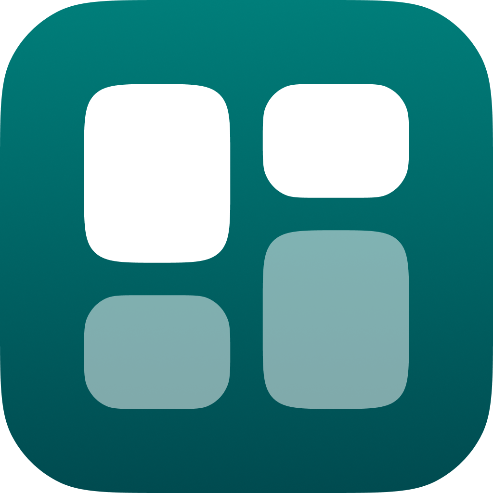

[ English](README_EN.md)

# QuadroFlow | Servidor

Aplicação de servidor | Uma aplicação de organização visual que combina a
simplicidade do quadro Kanban com a fluidez de um fluxo de trabalho ágil.

## 📦 Tecnologias

* [Dart](https://dart.dev/)

## 🖥️ Plataformas

* macOS (>=11.5) 🟡
* Windows (>=10.0) ✅
* Linux (baseado em debian) 🟡

## 🧑‍💻 Contribuição

🚫 Este projeto não está aceitando contribuições externas no momento, pois o
desenvolvimento principal ainda está em andamento. Fique atento às atualizações!

## 📜 Créditos

* SoftYes TI [\<softyes.com.br\>](https://softyes.com.br)
* João Sereia [\<joao.sereia@softyes.com.br\>](mailto:joao.sereia@softyes.com.br)
